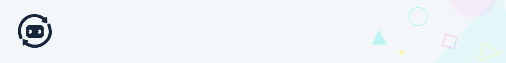
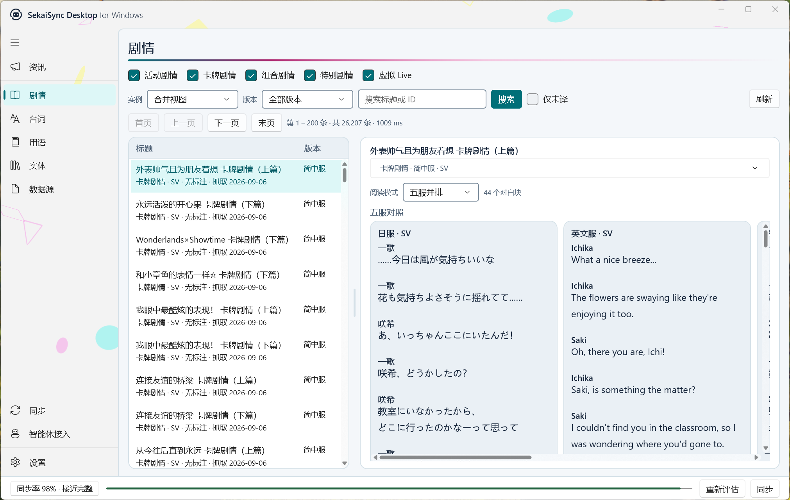
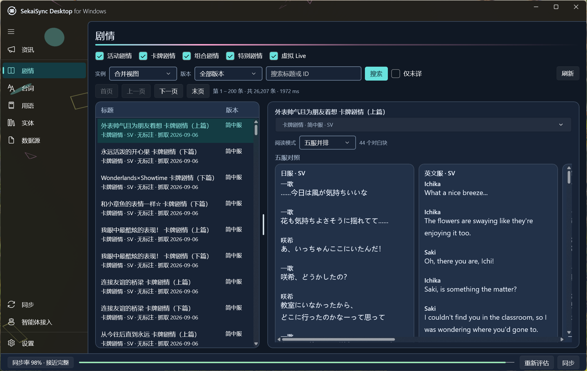

<!-- readme-brand:start -->
<picture>
  <source media="(prefers-color-scheme: dark)" srcset=".github/readme/header-dark.svg">
  
</picture>
<!-- readme-brand:end -->

# SekaiSync Desktop for Windows

English | [中文](README.zh-CN.md)

[](SekaiSync.Desktop.csproj) [](SekaiSync.Desktop.csproj) [](SekaiSync.Desktop.csproj) [](LICENSE)

<!-- readme-navigation:start -->
<p>
  <a href="#readme-overview">Overview</a> ·
  <a href="#readme-section-02">Quick start</a> ·
  <a href="#readme-section-04">More information</a>
</p>
<!-- readme-navigation:end -->

<a id="readme-overview"></a>

A Windows browser for the *Project SEKAI* knowledge base. The database is the one you synced
yourself — this program is just the comfortable way to read it. Announcements, stories, voice
lines, terminology, entities, raw tables, with the five languages laid out side by side instead of
six tabs you keep switching between.

Running a sync, or handing the whole store to an AI assistant, happens in the same window.






<a id="readme-section-01"></a>

## What's in it

Nine pages, split by what they do to your data. The top of the sidebar reads; the bottom changes
things.

**Reading** — announcements with the original post inlined, stories and card text with a
five-language parallel view, voice lines, terminology, entities across twelve asset domains, and a
raw-table view when you want to see exactly what is in the database.

**Doing** — sync the master data and announcements, inspect what is missing, cache story text, and
expose everything to a client over MCP or local HTTP.

Task output lands in one shared strip along the bottom of those two pages, so switching tabs does
not throw away a log you were reading. Close the window and the app waits in the system tray;
start it again and it brings the existing window forward rather than opening a second one.

<a id="readme-section-02"></a>

## Getting it running

```powershell
dotnet build SekaiSync.Desktop.csproj -p:Platform=x64
.\bin\x64\Debug\net8.0-windows10.0.19041.0\SekaiSync.Desktop.exe
```

Building needs .NET SDK 8 and Windows App SDK 1.8 (the latter arrives through NuGet).
The unpackaged output includes Windows App SDK dependencies but requires the .NET 8
runtime on the destination machine. Copy the complete output directory, not only the executable.

Point it at a store on the Settings page, or leave that blank and it will look for one near
itself. How the store gets built in the first place, what is in it, and what the CLI can do —
that is all covered in the [main repository](https://github.com/omoinoki/sekaisync).

<a id="readme-section-03"></a>

## One thing to know

The interface is Simplified Chinese only at the moment. The data it shows is not: you can read and
compare Japanese, English, Simplified and Traditional Chinese, and Korean.

<a id="readme-section-04"></a>

## License

MIT. See [LICENSE](LICENSE).
